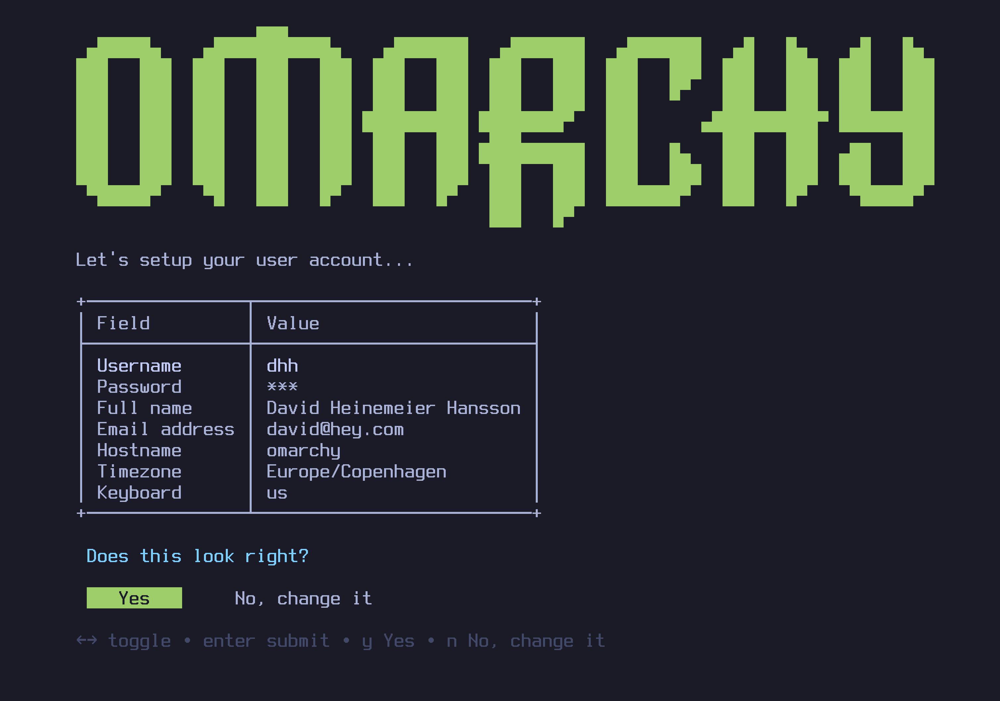
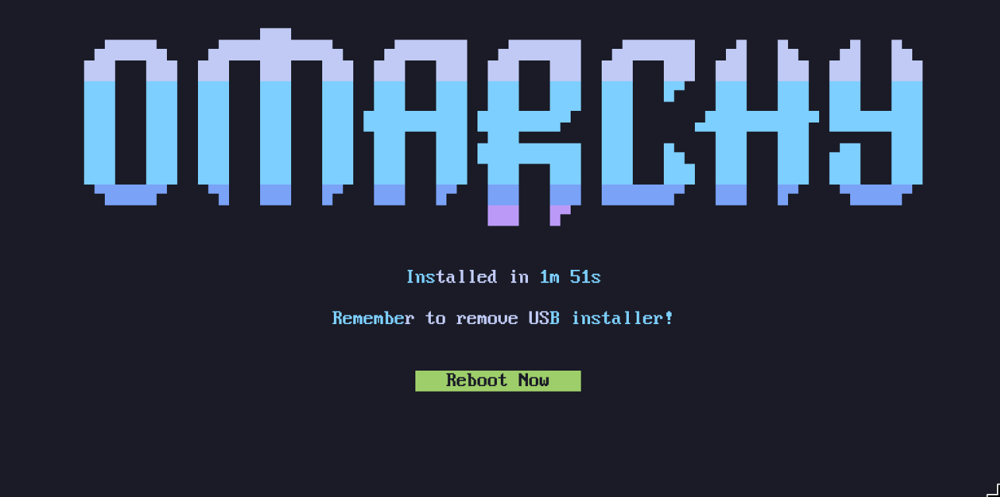

# 入门

Omarchy 是使用 ISO 安装的。它是为专用磁盘设计的，因此双启动需要您的机器中有两个磁盘（除非您进行[手动安装](https://learn.omacom.io/2/the-omarchy-manual/96/manual-installation)来解决此问题）。安装将擦除所选磁盘并使用全盘加密，因此请务必在使用现有驱动器之前进行备份！

首先[下载 Omarchy ISO](https://omarchy.org/)，将其放在 U 盘上（在 Mac/Windows 上使用 [balenaEtcher](https://etcher.balena.io/) 或在 Linux 上使用 [caligula](https://github.com/ifd3f/caligula)），然后从随身盘启动。

请记住，许多电脑在 BIOS 中都开启了安全启动和/或 TPM。您必须关闭这些才能安装 Omarchy。它们是适用于 Windows 和 Microsoft 附属 Linux 发行版的 Microsoft 安全方案。

然后回答配置问题，并按如下方式确认：

然后选择一个用于安装的驱动器，然后坐下来观看安装表演。这需要 2-10 分钟，具体取决于您计算机的速度。

现在你已经准备好进入 Omarchy！

----

## 使用有线或 2.4GHz 键盘！
全盘加密不允许您在启动时从蓝牙键盘输入密码。就像您不能使用蓝牙键盘进入 PC 上的 BIOS 一样。您需要一个使用 2.4GHz 加密狗或电缆的键盘（无论如何，这对于延迟来说要好得多！我个人很喜欢 [Lofree Flow84](https://www.lofree.co/products/lofree-flow-the-smoothest-mechanical-keyboard)！

----
## 如果卡住了，寻求帮助
如果您遇到困难，您通常可以在社区 Discord 的 #omarchy 帮助频道中找到愿意提供帮助的人。

---
## 特殊需要使用手动安装
如果您有特殊需求，例如将 Omarchy 安装到 M 系列 MacBook [Asahi Alarm](https://asahi-alarm.org/) 上，或者因为您想尝试在单个驱动器上进行双启动，则应[按照说明进行手动安装](https://learn.omacom.io/2/the-omarchy-manual/96/manual-installation) 。
