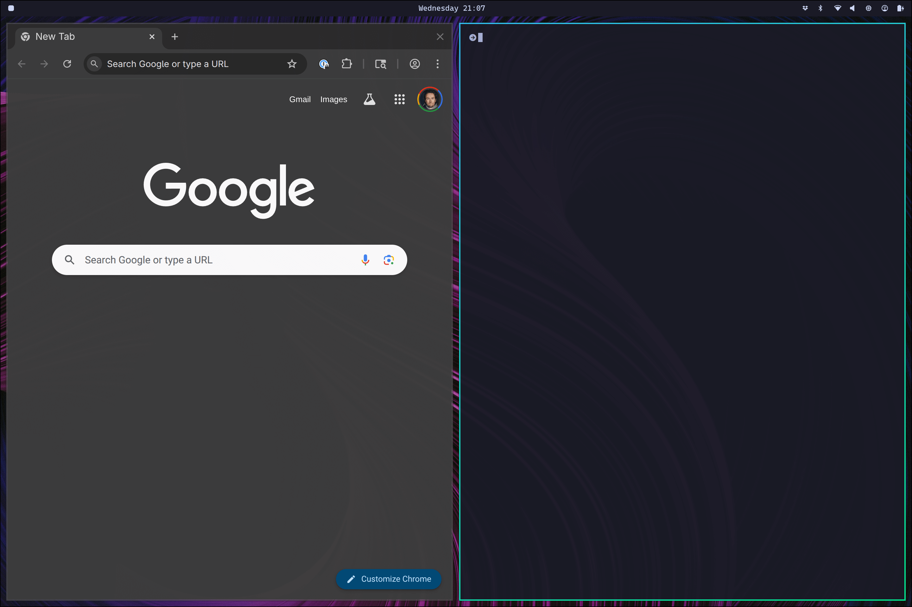
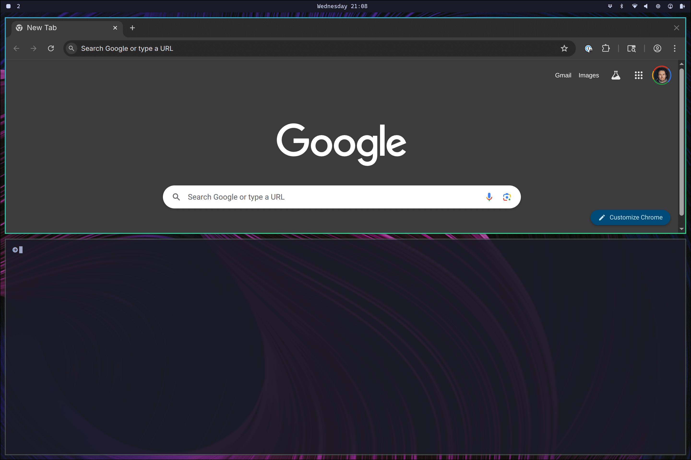
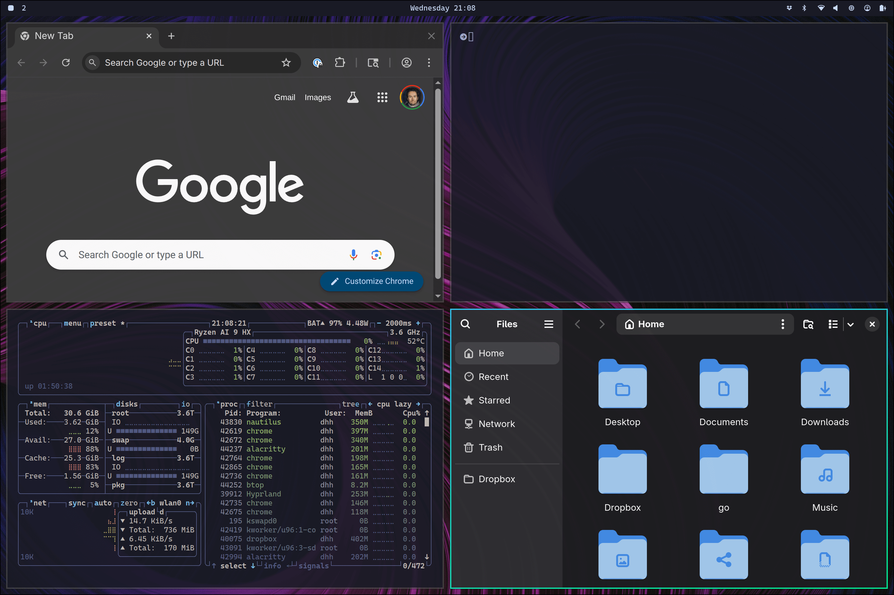

# 导航

Omarchy 中的所有操作都通过键盘进行—— 一切！ 当系统第一次启动时，您实际上无法仅用鼠标做任何事情。但是您可以点击 `Super + Space` 以显示应用程序启动器，并按 `Super + Alt + Space` 打开 Omarchy 菜单。这两个命令允许您执行几乎所有动作。

但是应用程序启动器并不是大多数时候作系统的主要方式。我们可以比这更快！所有最重要的应用程序都直接绑定到各个热键。您使用 `Super + Return` 启动终端，使用 `Super + Shift + B` 启动浏览器。尝试一个接一个地做，你会看到 Hyprland 平铺窗口的魔力在起作用：

然后，您可以点击 `Super + J` 将它们水平而不是垂直堆叠：

再次按下 `Super + J` 将它们返回到水平位置。然后在浏览器上尝试 `Super + Shift + Arrow Right` 来交换窗口。

现在尝试 `Super + Shift + T` 启动活动监视器，然后尝试 `Super + Shift + F` 打开文件管理器。您将有一个简洁的四向设置：

您可以使用` Super + 方向键`在要激活的窗口之间导航。这将切换焦点并将光标移动到新应用程序的中心。

如果按 `Super + Shift + 2`，则会将当前焦点应用程序移动到第二个工作区。`Super + Shift + 1` 将其向后移动。

如果您按住 `Super` 并使用鼠标单击窗口，您将能够重新排列它的位置。如果您按住 `Super` 并使用鼠标右键，您可以自由调整窗口大小。

您在 `Super + W` 上关闭窗口，然后可以使用 `Super + T` 将窗口自由浮动（并再次将其返回到图块）

您还可以使用 `Super + F` 进行全屏显示，甚至可以使用 `Super + Alt + F` 进行全屏显示（保留顶部栏）。

可以使用 `Super + G` 对窗口进行分组。加入组后，您在活动时启动的每个窗口都将属于该组。您可以使用 `Super + Alt + Tab` 或 `Super + Alt + 1/2/3/4` 在这些分组窗口之间切换，以按顺序直接转到选项卡。您可以使用 `Super + Alt + G` 将窗口移出分组，或者再次按 `Super + G` 来拆解整个组。最后，您可以使用 `Super + Alt + [方向键]` 将组外的窗口移动到其中。

习惯像这样导航桌面需要一点时间，但一旦习惯，就很难回到传统的鼠标驱动桌面体验
